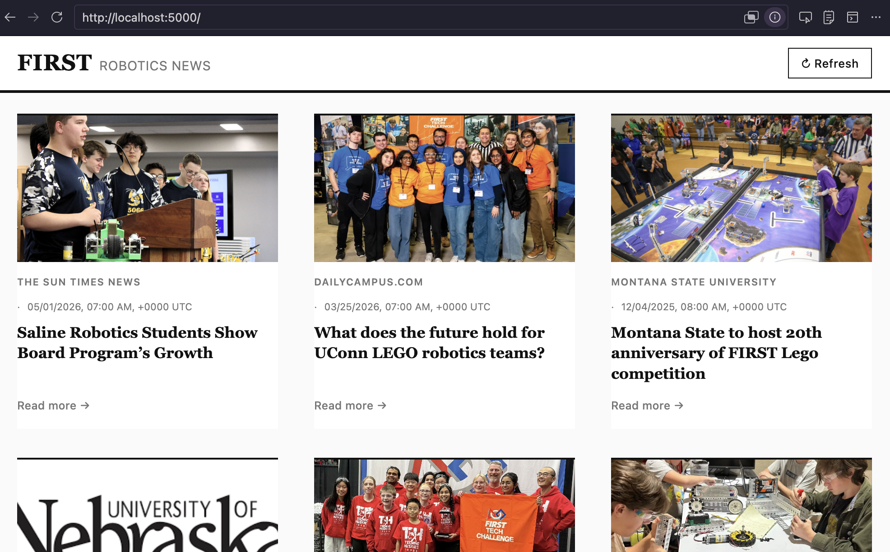
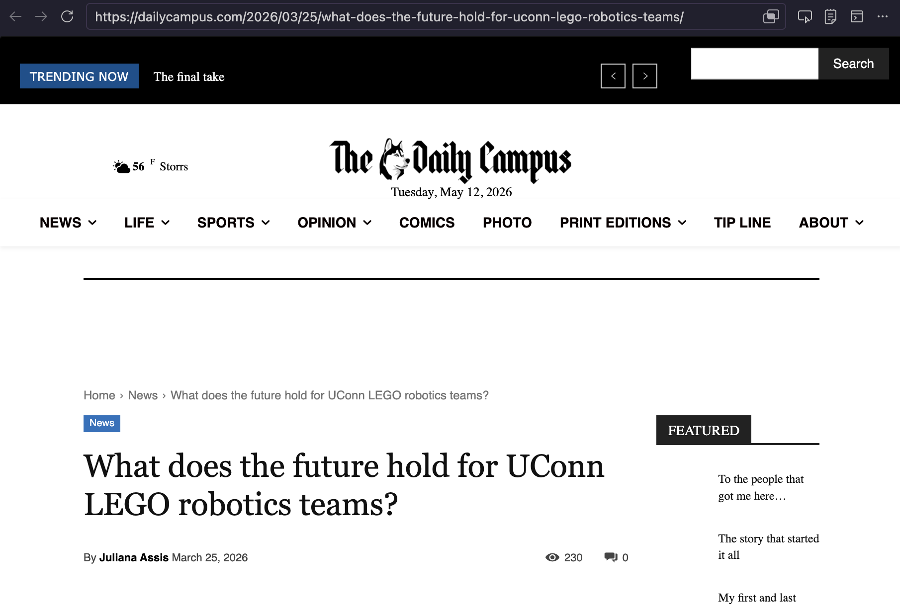
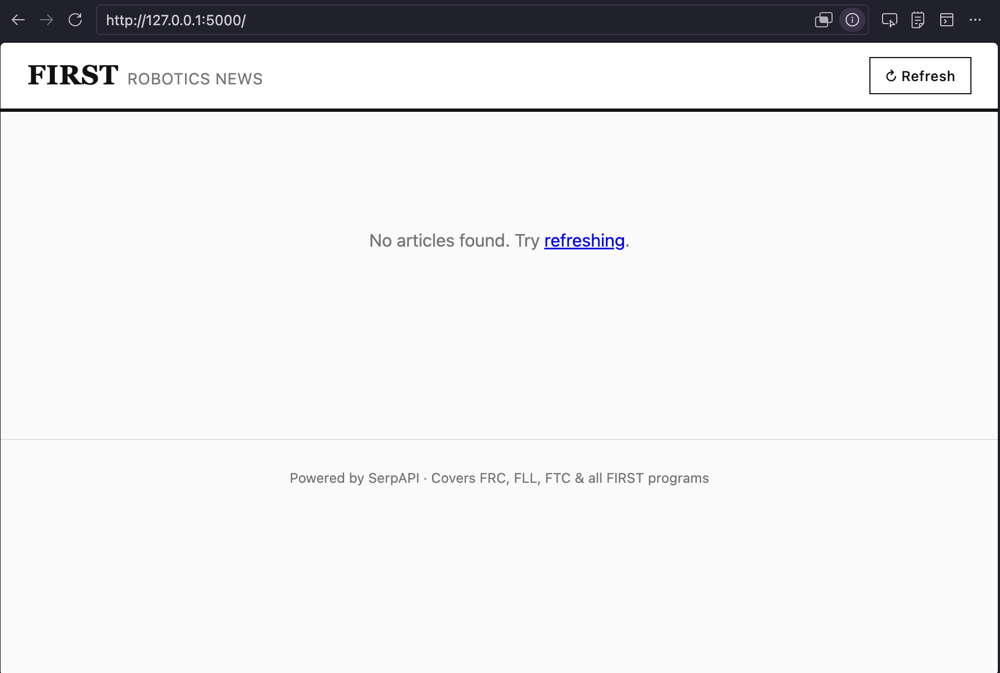

# FIRST Robotics News App
A little web app which leverages SerpAPI to generate a feed of news articles about FIRST Robotics.

## Overview/Features
- Flask-based web application querying Google News
- 24-hr caching to reduce API calls
- Manual refresh button

## Project Structure
```
    serpapi/
    ├── FIRSTnews.py          # main app
    ├── requirements.txt      # dependencies
    ├── news_cache.json       # caching for news articles
    ├── .env                  # environment variabls (byo .env)
    ├── README.md             # you are here
    ├── static/
    │   └── style.css        # app stylings
    └── templates/
        └── index.html       # html template for news feed
```

## Screenshots
Some examples of the web app

### Home Page/News Feed


### Serving a Full Article


### Error Messages


## Local Setup
1. Clone or download the repo/navigate to your local directory
2. Create a virtual env:
    ```
    python3 -m venv .venv
    source .venv/bin/activate
    ```
3. Install dependencies
    ```
    pip install -r requirements.txt
    ```
4. Set up environment variables
    - create a ```.env``` file in your app directory
    - add your SerpAPI key
    ```
    SERPAPI_KEY=your_key_here
    ```
5. Run the app
    ```
    python FIRSTnews.py
    ```
6. Visit the site @ ```http://localhost:5000```
